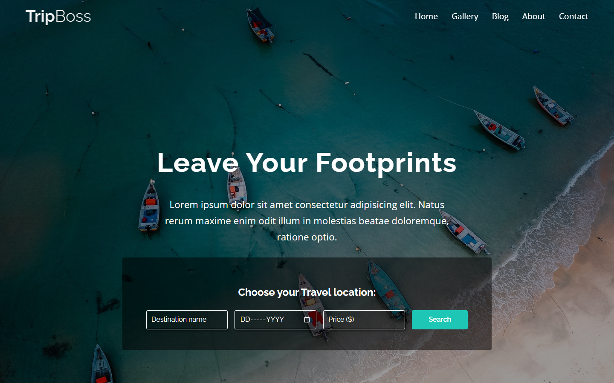
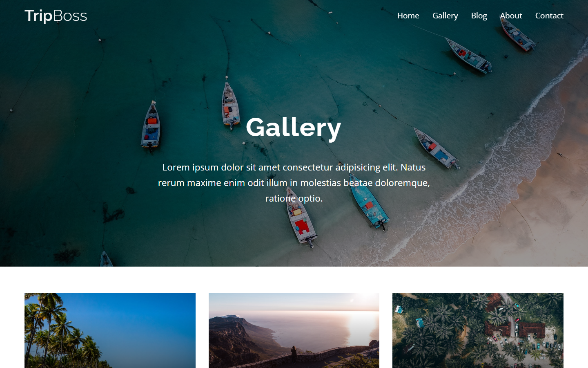
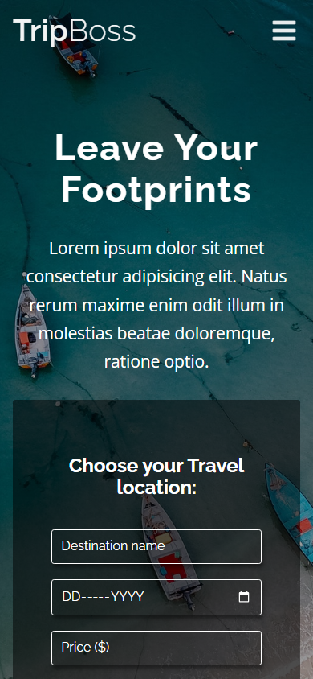

# TripBoss — travel site template

A five-page responsive website template for a travel company, built with plain
HTML, CSS, and JavaScript. No framework and no build step: open `index.html` and
it runs.

The copy is placeholder text. This is a template — the layout, styling, and
responsive behaviour are the deliverable, not the words.

---

## Screenshots

| Home | Gallery |
|---|---|
|  |  |



---

## Pages

| File | Contents |
|---|---|
| `index.html` | Hero with a destination search form, feature sections, a video section |
| `gallery.html` | Image grid |
| `blog.html` | Post listing |
| `about.html` | Company and team sections |
| `contact.html` | Contact form and details |

## Stylesheets

CSS is split by role rather than by page:

| File | Role |
|---|---|
| `css/normalize.css` | Cross-browser baseline |
| `css/utility.css` | Shared helpers |
| `css/style.css` | Component and layout styling |
| `css/responsive.css` | Breakpoints |
| `font/fonts.css` | Font faces |

Icons come from Font Awesome over a CDN, so they need a network connection; the
rest of the site works offline.

---

## Running it

No build, no dependencies. Open `index.html` directly, or serve the directory so
the video and relative paths behave as they would on a host:

```bash
python -m http.server 8000
```

Then visit http://localhost:8000.

---

## Notes

`videos/video-section.mp4` is 28 MB and is committed, because `index.html` plays
it. It dominates the size of this repository. A real deployment would serve it
from a CDN or object storage instead.

The forms are markup only. There is no backend, so the search and contact forms
do not submit anywhere.

---

## License

MIT — see [LICENSE](LICENSE).
